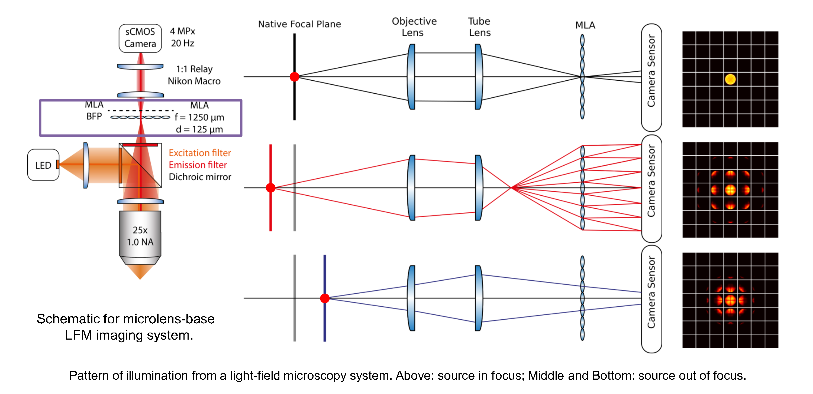
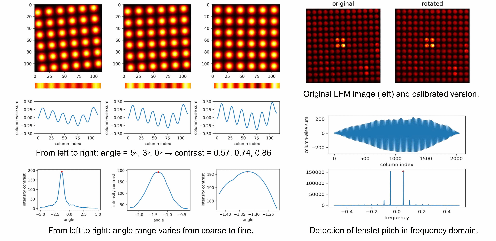
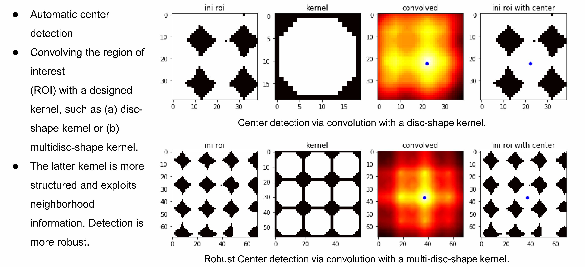
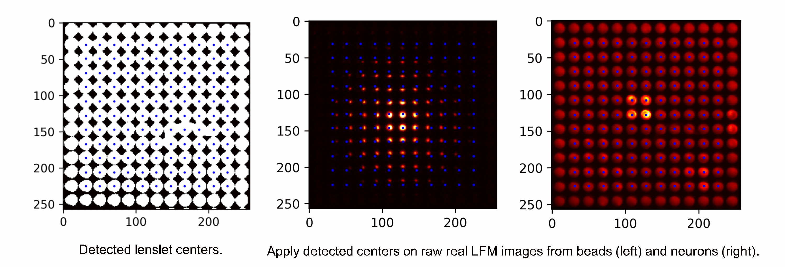
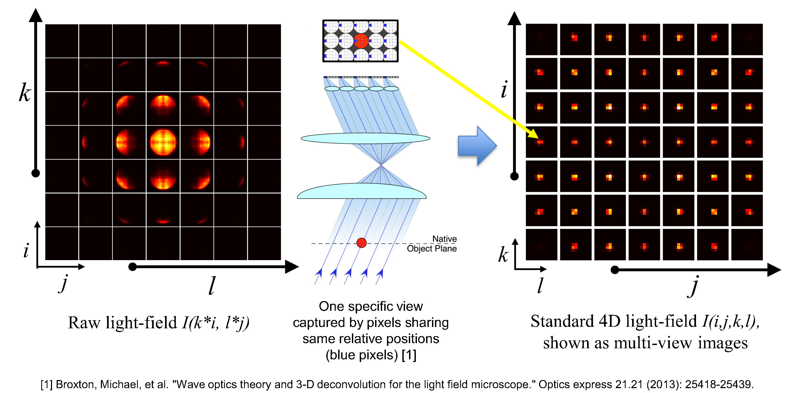
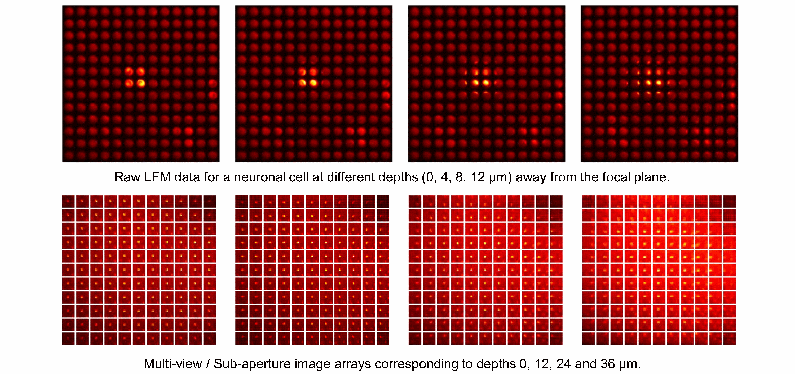
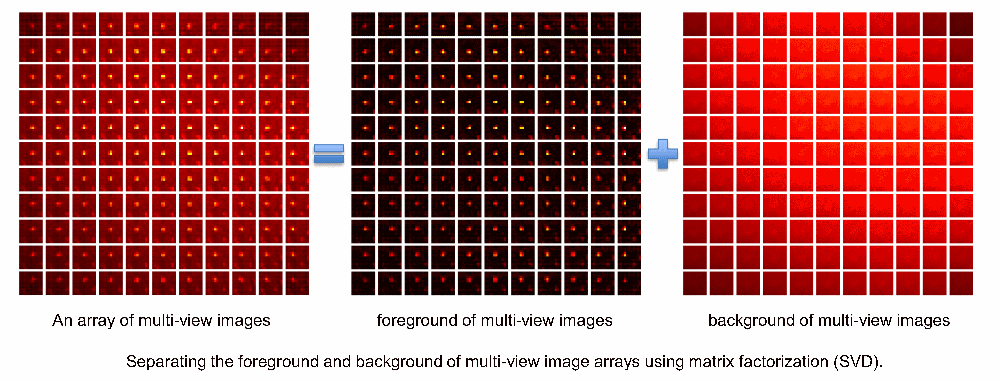
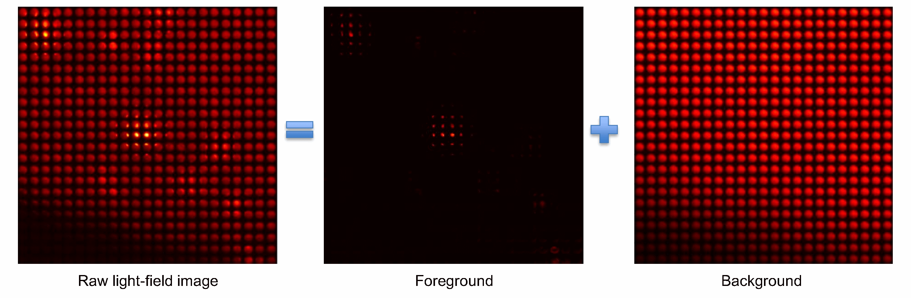

# Pre-processing for 3D Localization using Light-Field Microscopy data

This software is to perform some calibration and pre-processing operations on the light field microscopy (LFM) data, including:

- Detect the rotation angle of a raw LFM image.
- Detect lenslet pitch.
- Crop a region of interest (ROI) from each LFM frame.
- Detect the centers of the microlens array using an out-of-focus LFM image, instead of a white image.
- Extract micro-images to construct 4D LFM data.
- Convert 4D LFM data to multi-view / sub-aperture images.
- Perform matrix factorization to separate the foreground and background.
- Convert the foreground to a clean LF image.

Original data is from: 
[path]/Chronos_Test/chronos_190301/MLA_1x1_f_2-8_50ms_490nm_1
Now the data is copied to:
[path]/LFMdata/LFimg.tif

References：
----------------------------
[1] P. Song, H. Verinaz Jadan, C. L. Howe, P. Quicke, A. J. Foust and P. L. Dragotti, "3D Localization for Light-Field Microscopy via Convolutional Sparse Coding on Epipolar Images," in IEEE Transactions on Computational Imaging, doi: 10.1109/TCI.2020.2997301.

[2] P. Song, H. Verinaz Jadan, P. Quicke, C. L. Howe, A. J. Foust, and P. L. Dragotti, "Location Estimation for Light Field Microscopy based on Convolutional Sparse Coding," in Imaging and Applied Optics 2019 (COSI, IS, MATH, pcAOP), OSA Technical Digest (Optical Society of America, 2019), paper MM2D.2

Usage:
----------------------------

Run 'main_LFM_preprocess.py' to explore each calibration and pre-processing operation.

If you want to use your own images, please put them in folder "LFMdata", update the 'WhiteImg.tif' with an appropriate out-of-focus light-field image, and update the data path and some parameters accordingly in the code file.

Parameters Setting:
----------------------------
Please refer to the code file for details. 

Contact:
----------------------------
Please report problems to

Pingfan Song

Electronic and Electrical Engineering,

Imperial College London

p.song@imperial.ac.uk

Some introduction and results:
----------------------------

Figure 1: Schematic and some patterns of illumination from our light-field microscopy system. 

Figure 2: Data calibration for raw light-field microscopy images. Detection of the rotation angle and the lenslet pitch.

Figure 3: Data calibration for raw light-field microscopy images. Detection of centers of the microlens array.

Figure 4: Data calibration for raw light-field microscopy images. Detection of centers of the microlens array.

Figure 5: Convert a raw 2D light-field image to 4D Multi-view image arrays

Figure 6: Convert raw 2D light-field images to 4D Multi-view image arrays

Figure 7: Separate the foreground and background of multi-view image arrays using SVD based matrix factorization.

Figure 8: Convert the foreground and background from multi-view image arrays to light-field images.

